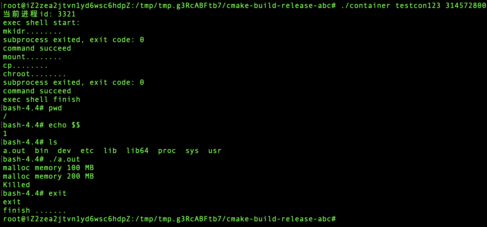

# containerCoreByC
### 简介
+ [博客地址](https://www.jianshu.com/p/112d2b281282)

C语言实现容器核心技术
+ 视图隔离-namespaces
+ 资源控制-cgroups
+ chroot

### 目的
了解容器技术的原理与实现方式

### 实验环境
ubuntu:18.04
cmake:3.10.2
chroot(GNU coreutils):8.28
unshare:2.31.1

### 使用
`./container [container_name] [limit_in_bytes]`
+ container_name
创建容器的名称，默认创建在`root\`下
+ limit_in_bytes
容器可分配的最大内存(B)
### test
`chmod 777 chrootinit.sh `

`chmod 777 cgroupsinit.sh `
+ 启动容器名为con123，可内配最大内存为314572800
    ```shell script
    ./container con123 314572800
    ```
+ 查看当前进程号
    ```shell script
    echo $$
    ```
+ 查看当前目录
    ```shell script
    pwd
    ```
+ 测试当前进程可分配的内存
    + 原bash不动，创建一个新bash
    + `touch test.c` 
    + `vim test.c`
        ```c    
        #include<stdio.h>
        #include<stdlib.h>
        #include<string.h>
        
        #define CHUNK_SIZE 1024 * 1024 * 100
        
        void main(){
            char *p;
            int i;
        
            for(i = 0; i < 10; i ++)
            {
                p = malloc(sizeof(char) * CHUNK_SIZE);
                if(p == NULL){
                    printf("fail to malloc!");
                    return ;
                }
                memset(p, 0, CHUNK_SIZE);
                printf("malloc memory %d MB\n", (i + 1) * 100);
            }
        }
        ```
    + `gcc test.c`
    + `cp a.out /root/con123`
    + 回到原来bash执行 `./a.out`
### 演示

